# GitHub Copilot Resources - Visual Guide

Visual representation of how to use the GitHub Copilot resources in this project.

## 📊 Resource Structure

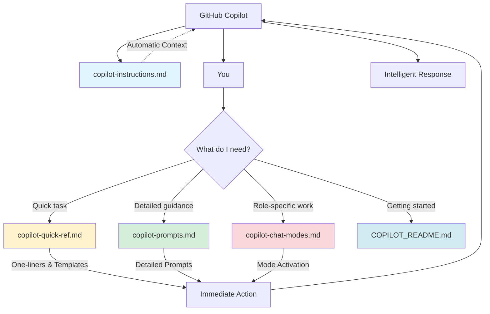

## 🔄 Typical User Workflow

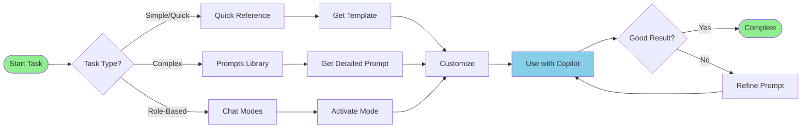

## 🎯 Decision Tree: Which Resource to Use?

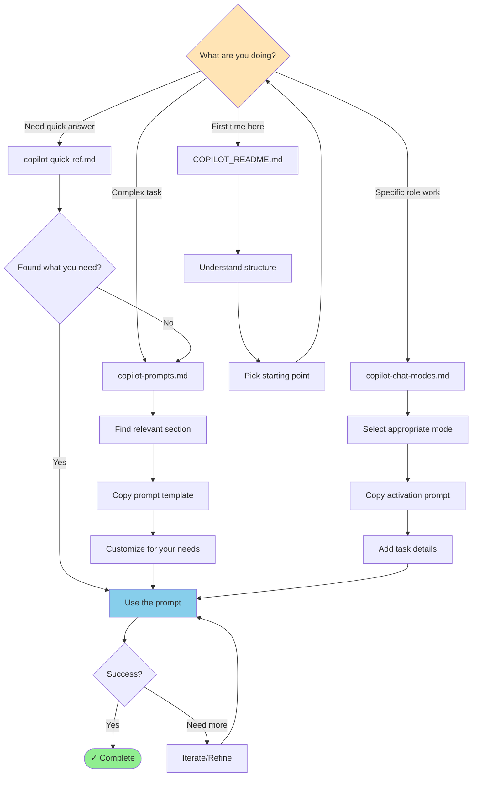

## 📚 Resource Comparison

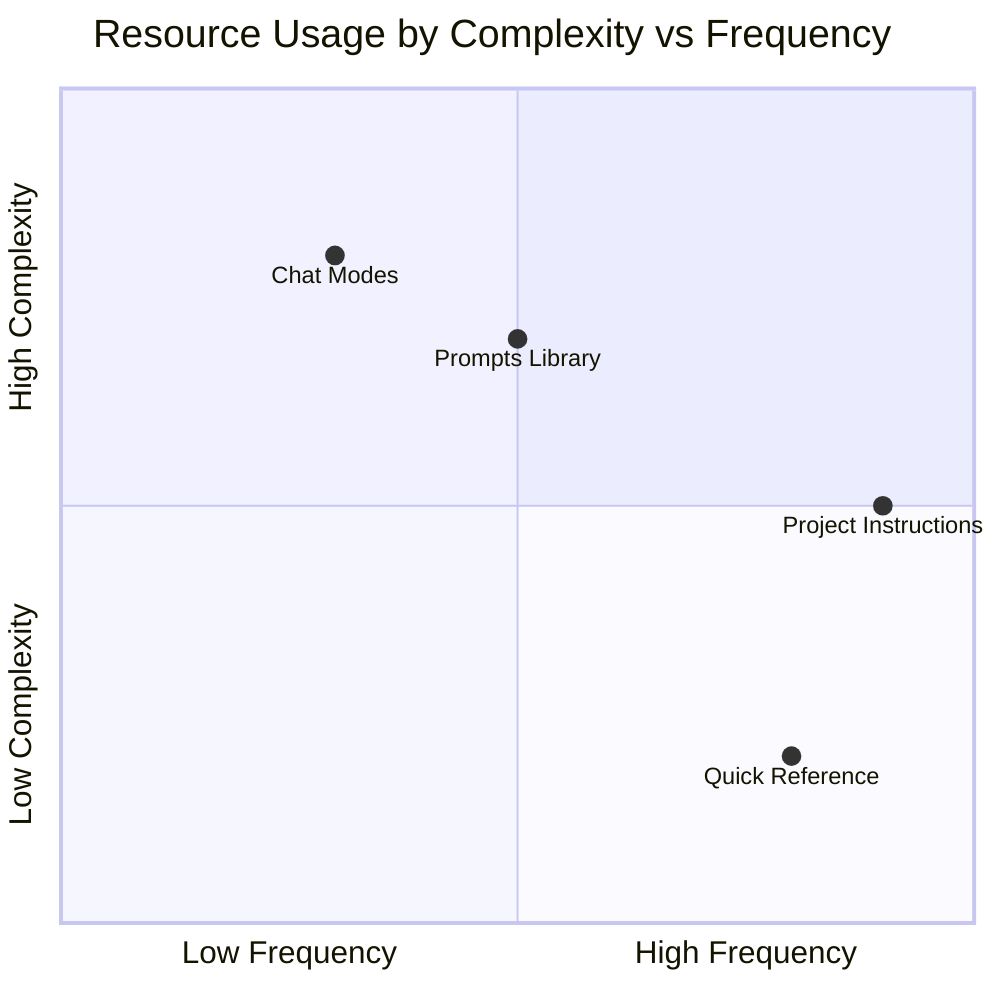

## 🎭 Chat Modes Overview

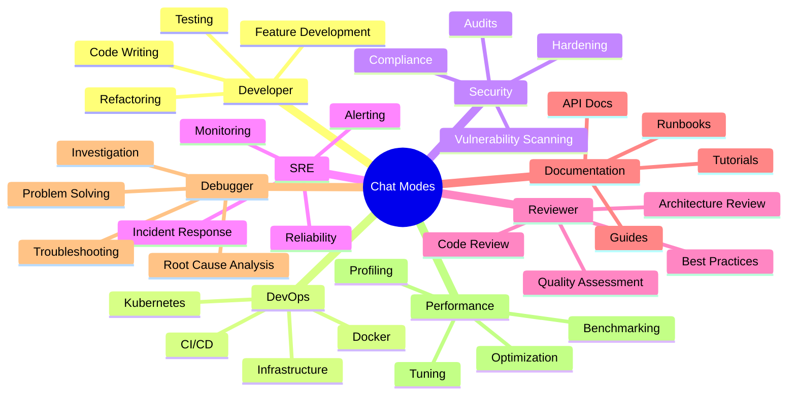

## 🔄 Feature Development Workflow

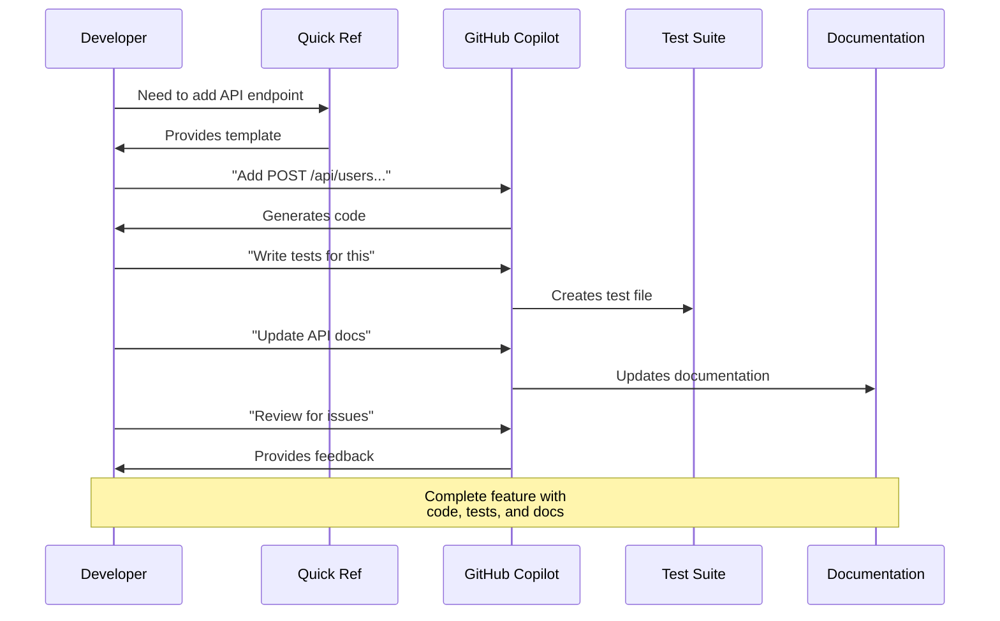

## 🐛 Debugging Workflow

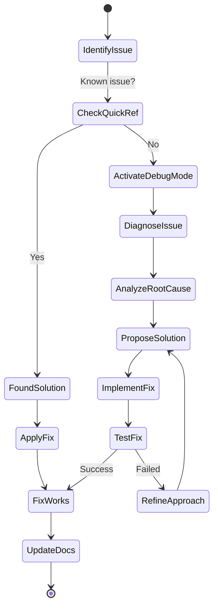

## 📊 Prompt Complexity Levels

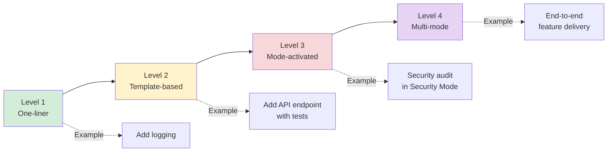

## 🎯 Learning Path Visualization

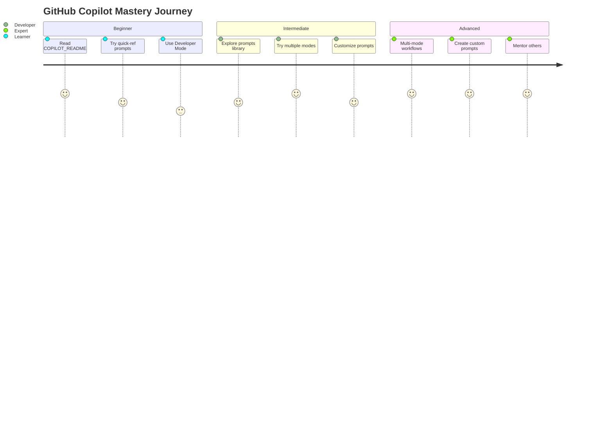

## 🔄 Resource Update Cycle

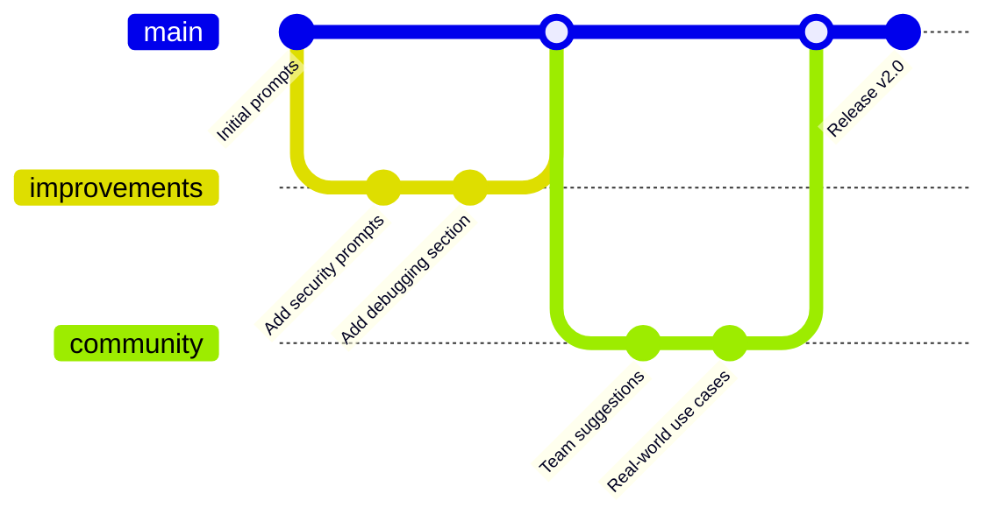

## 📈 Effectiveness Metrics

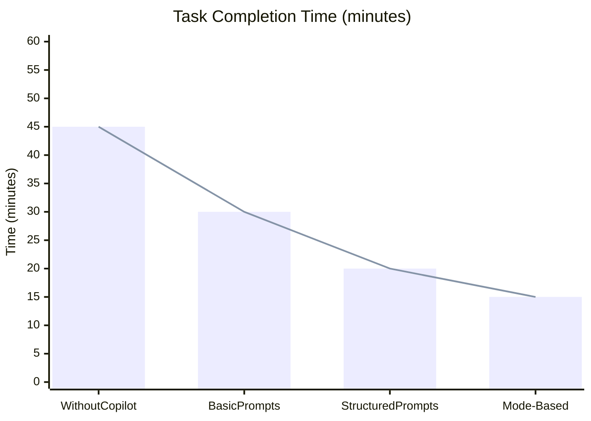

## 🎪 Multi-Mode Workflow Example

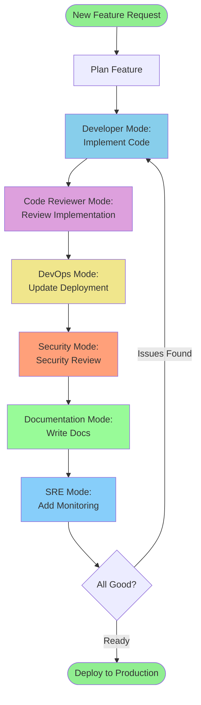

## 🎨 Color Legend

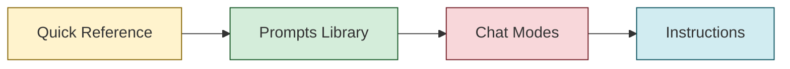

**Legend:**
- 🟡 Quick Reference - Fast, immediate use
- 🟢 Prompts Library - Detailed, structured
- 🔴 Chat Modes - Role-based, specialized
- 🔵 Instructions - Context, automatic

## 📱 Quick Access Matrix

| Scenario | Resource | Section | Time to Use |
|----------|----------|---------|-------------|
| Add endpoint | Quick Ref | Development | 30 seconds |
| Write tests | Prompts Library | Testing | 2 minutes |
| K8s troubleshooting | Chat Modes | DevOps Mode | 5 minutes |
| Security audit | Chat Modes | Security Mode | 10 minutes |
| Architecture diagram | Prompts Library | Documentation | 3 minutes |
| Performance optimization | Chat Modes | Performance Mode | 15 minutes |
| Bug fix | Quick Ref | Debugging | 1 minute |

## 🎯 Resource Selection Flowchart

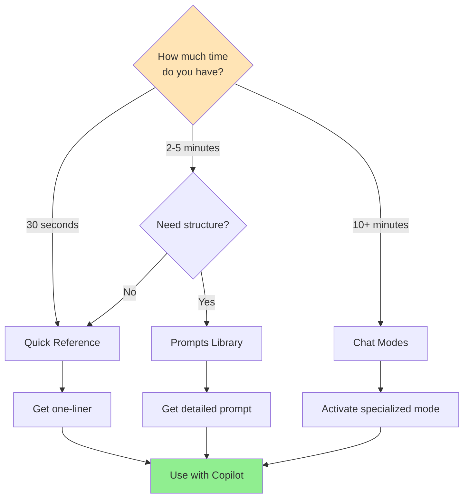

## 🔗 Resource Relationships

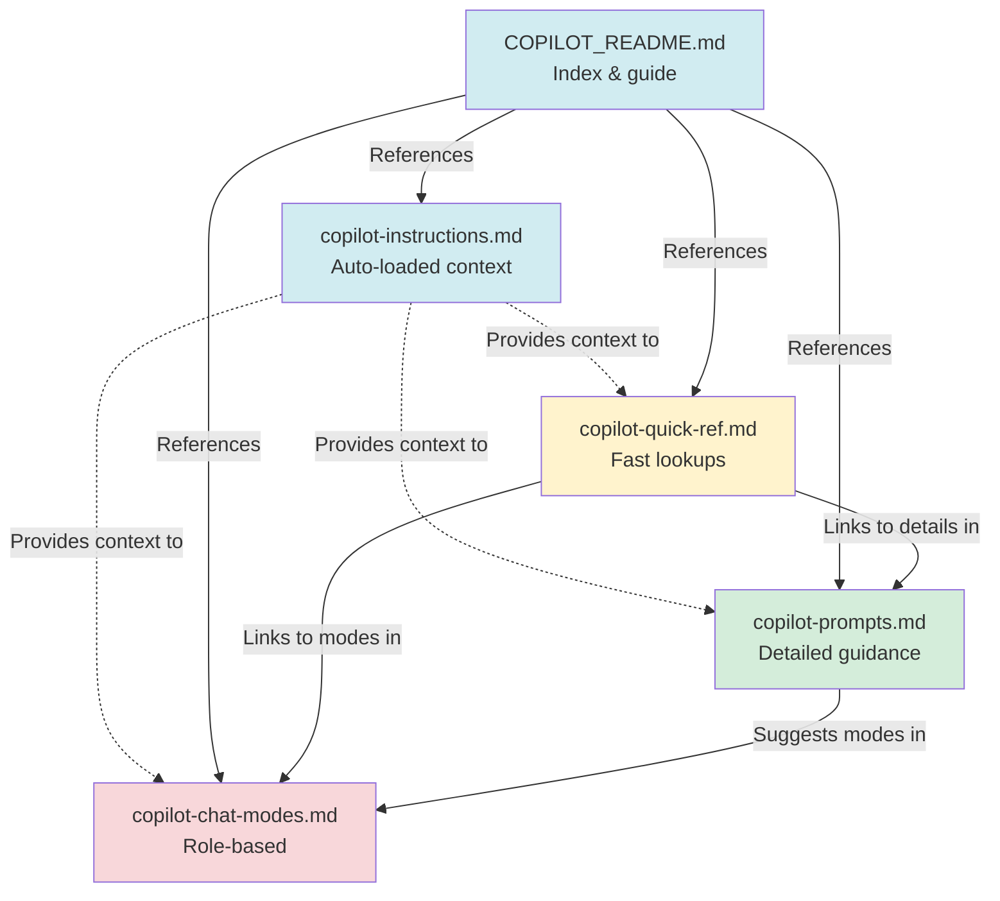

---

## 🎓 Usage Examples

### Example 1: Quick Task
```
Scenario: Need to add logging
Time: 30 seconds

Path: Quick Reference → Development section
Action: Copy one-liner: "Add logging to /health endpoint"
Result: Immediate implementation
```

### Example 2: Complex Feature
```
Scenario: Add user authentication
Time: 10-15 minutes

Path: Chat Modes → Developer Mode
Action: Use feature development template
Result: Complete implementation with tests and docs
```

### Example 3: Debugging Issue
```
Scenario: Pod won't start
Time: 5 minutes

Path: Quick Reference → Debugging
      → Chat Modes → DevOps Mode (if needed)
Action: Use debugging shortcuts, escalate to mode if complex
Result: Identified root cause and fix
```

---

## 💡 Pro Tips Visual

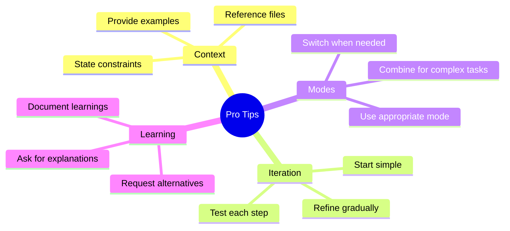

---

## 🎯 Success Pattern

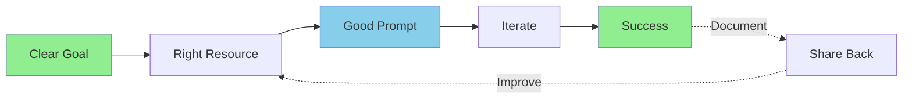

---

## 📊 Resource ROI

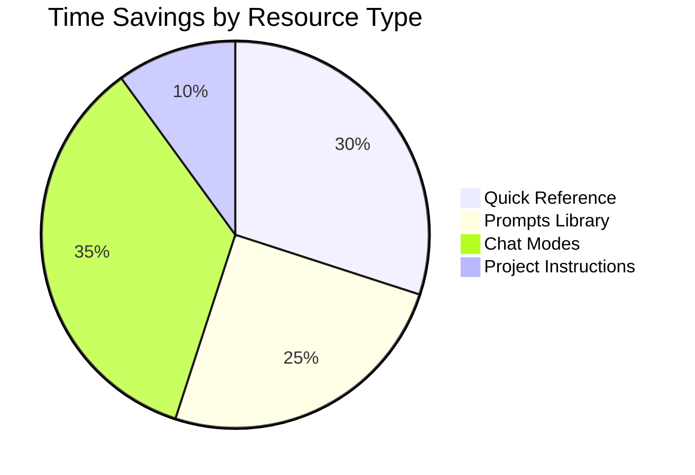

---

**Visual guides help you quickly understand how to use GitHub Copilot resources effectively!**

For interactive use, refer to the individual resource files.
